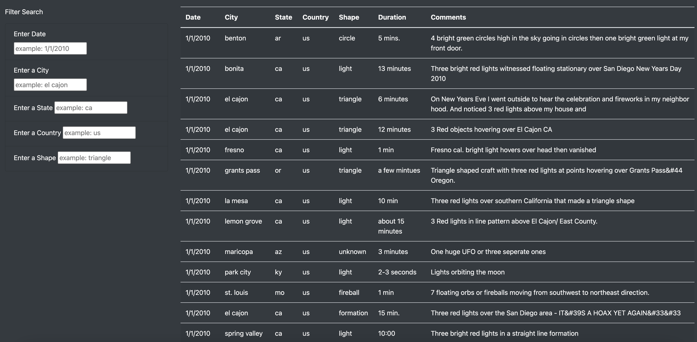
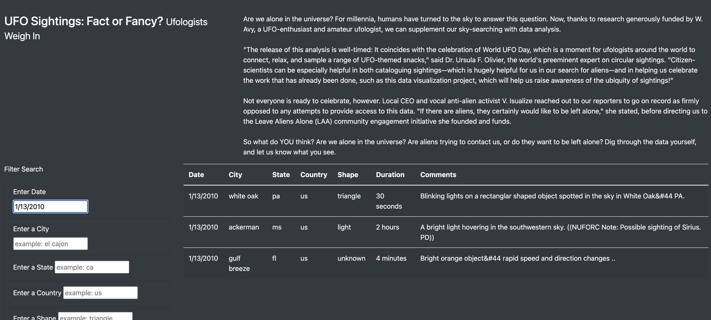
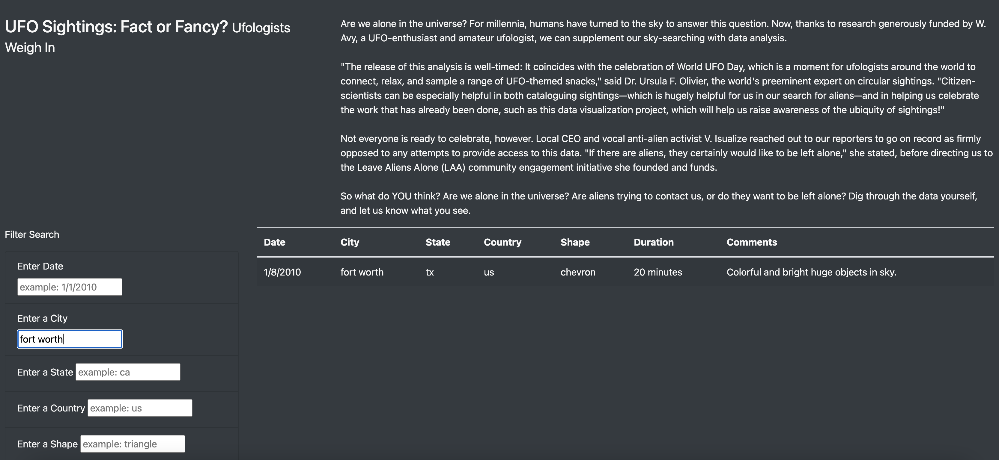

# UFO Sightings

## Overview of Project: Explain the purpose of this analysis.
The purpose of this analysis was to create a table to organize UFO data that is stored as a JavaScript array, which we then gave the ability to filter data based on certain criteria. We used JavaScript as our primary coding language to create filters and make our table fully dynamic. This allows for easy user input. We also placed our table into a user-friendly HTML file for easy viewing. We wanted an easy-to-use and good-looking table design to make reading and analyzing the information present in our table a breeze. 

## Results: Describe to Dana how someone might use the new webpage by walking her through the process of using the search criteria. Use images of your webpage during the filtering process to support your explanation.

In the following image, you can see our fully functional table with our filter search ability built-in. There is a lot of information with multiple dates, locations, and comments to go through. 

What if you just wanted UFO sightings for 1/13/2010? Then you would fill out that date in the "Enter Date" filter and press "Enter". That would show you only the UFO sightings that occurred on 1/13/2010, as you can see below. 

Or what if you just wanted UFO sightings that occured in Fort Worth, TX? You would just simply type in "fort worth" into the "Enter a City" filter and press enter. This would show you the UFO sighting(s) that occurred in Fort Worth, as you can see below. 

## Summary: In a summary statement, describe one drawback of this new design and two recommendations for further development.

<u> Drawback of this design </u>

The big design flaw for me is that there is no actual search button. While I naturally just press "Return" on my keyboard when I'm done filling out a search bar,   the page felt off without a physical search button. 
  
Two recommendations for further development

1. While there is a lot of information present in data.js, I know there is a lot more information regarding UFO sightings out there. My first recommendation would be to identify and add more UFO sightings to the data sheet. 
  
2. I would add the aforementioned "Search" button to the page to give it a cleaner and more natural look.  

